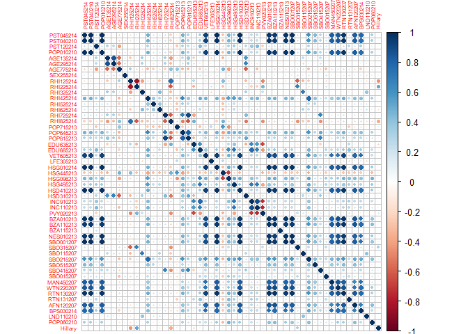
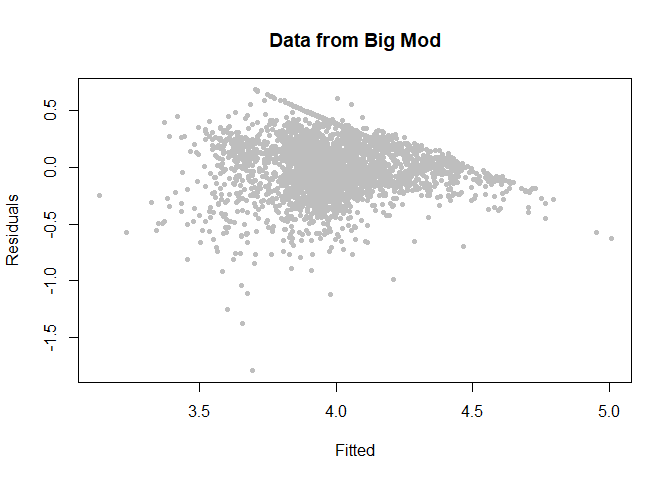
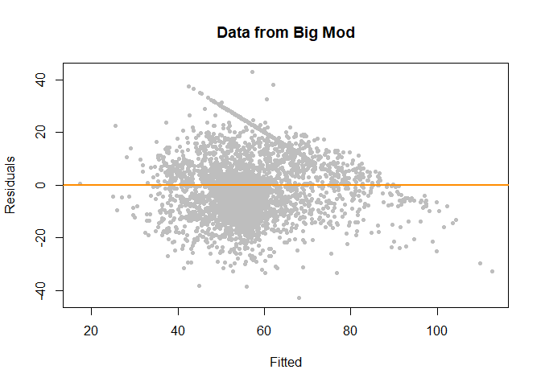
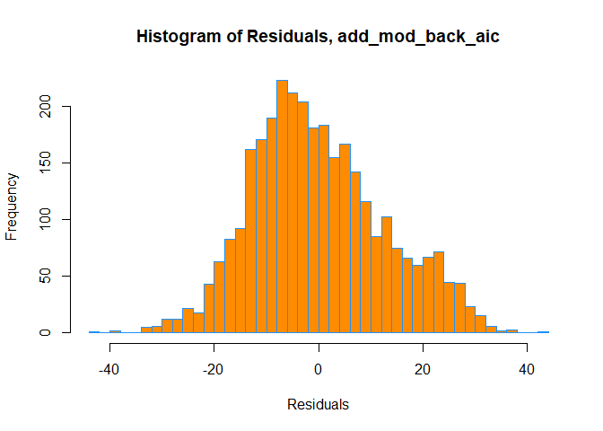
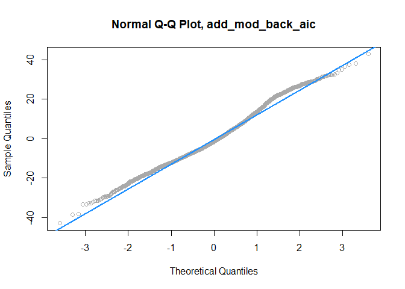
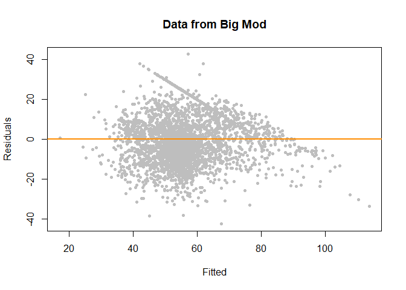
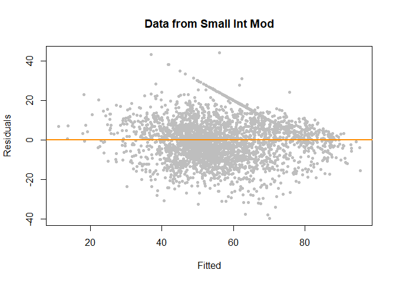
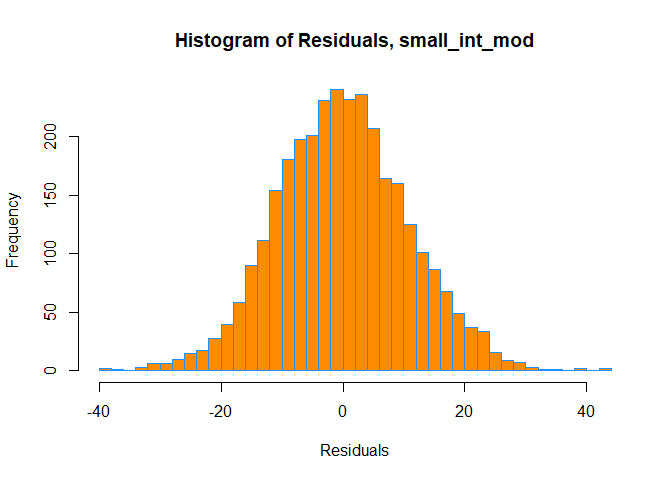
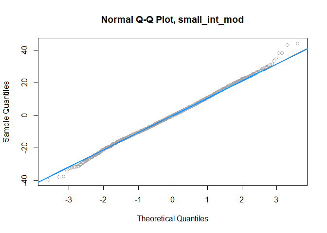

Team 420 Final Project
================
Ruben Verghese:rubenv2, Simer Singh:ssing36, Gautam Ajjarapu:gka2, James
Wei:jamesw7
December 14, 2020

# Introduction

The 2016 Primaries were influenced by many factors and the race between
Bernie and Hillary across the United States was close. There are many
factors that may have determined whether Hillary or Bernie won each
county in each state. We tried to find a statistical model that could,
given statistics about a specific county in a specific state, make a
prediction for the fraction of Democratic votes Hillary would win. This
fulfills the requirement for a continuous response variable because the
output is a proportion. By being able to accurately predict the
proportion of one democratic candidate given statistics about a county,
we can make predictions about any future races and maybe see if similar
models can be built.

Some methods we used in this project are Data Cleaning/Formatting,
Variable Selection, ANOVA, Multiple Linear Regression, Interaction,
Dummy Variables, Residual Diagnostics, Outlier Diagnostics,
Transformations, and Stepwise Model Selection. We predict that one of
our interaction models will be the best because it includes all of the
two-way interactions, which may help with such a high dimensional data
set. We also predict that our smaller interaction model will outperform
our other models in terms of *R*<sup>2</sup> and RMSE.

## Data Source

Dataset source is Kaggle.com
<https://www.kaggle.com/benhamner/2016-us-election/>

## Data Information

The data is split up into all of the different candidates from both the
republican and democratic parties. We chose to focus specifically on
Hillary Clinton and use her proportion of votes in each county as the
response variable.

| Column Name | Description                                                            |
|-------------|------------------------------------------------------------------------|
| PST045214   | Population, 2014 estimate                                              |
| PST040210   | Population, 2010 (April 1) estimates base                              |
| PST120214   | Population, percent change - April 1, 2010 to July 1, 2014             |
| POP010210   | Population, 2010                                                       |
| AGE135214   | Persons under 5 years, percent, 2014                                   |
| AGE295214   | Persons under 18 years, percent, 2014                                  |
| AGE775214   | Persons 65 years and over, percent, 2014                               |
| SEX255214   | Female persons, percent, 2014                                          |
| RHI125214   | White alone, percent, 2014                                             |
| RHI225214   | Black or African American alone, percent, 2014                         |
| RHI325214   | American Indian and Alaska Native alone, percent, 2014                 |
| RHI425214   | Asian alone, percent, 2014                                             |
| RHI525214   | Native Hawaiian and Other Pacific Islander alone, percent, 2014        |
| RHI625214   | Two or More Races, percent, 2014                                       |
| RHI725214   | Hispanic or Latino, percent, 2014                                      |
| RHI825214   | White alone, not Hispanic or Latino, percent, 2014                     |
| POP715213   | Living in same house 1 year & over, percent, 2009-2013                 |
| POP645213   | Foreign born persons, percent, 2009-2013                               |
| POP815213   | Language other than English spoken at home, pct age 5+, 2009-2013      |
| EDU635213   | High school graduate or higher, percent of persons age 25+, 2009-2013  |
| EDU685213   | Bachelor’s degree or higher, percent of persons age 25+, 2009-2013     |
| VET605213   | Veterans, 2009-2013                                                    |
| LFE305213   | Mean travel time to work (minutes), workers age 16+, 2009-2013         |
| HSG010214   | Housing units, 2014                                                    |
| HSG445213   | Homeownership rate, 2009-2013                                          |
| HSG096213   | Housing units in multi-unit structures, percent, 2009-2013             |
| HSG495213   | Median value of owner-occupied housing units, 2009-2013                |
| HSD410213   | Households, 2009-2013                                                  |
| HSD310213   | Persons per household, 2009-2013                                       |
| INC910213   | Per capita money income in past 12 months (2013 dollars), 2009-2013    |
| INC110213   | Median household income, 2009-2013                                     |
| PVY020213   | Persons below poverty level, percent, 2009-2013                        |
| BZA010213   | Private nonfarm establishments, 2013                                   |
| BZA110213   | Private nonfarm employment, 2013                                       |
| BZA115213   | Private nonfarm employment, percent change, 2012-2013                  |
| NES010213   | Nonemployer establishments, 2013                                       |
| SBO001207   | Total number of firms, 2007                                            |
| SBO315207   | Black-owned firms, percent, 2007                                       |
| SBO115207   | American Indian- and Alaska Native-owned firms, percent, 2007          |
| SBO215207   | Asian-owned firms, percent, 2007                                       |
| SBO515207   | Native Hawaiian- and Other Pacific Islander-owned firms, percent, 2007 |
| SBO415207   | Hispanic-owned firms, percent, 2007                                    |
| SBO015207   | Women-owned firms, percent, 2007                                       |
| MAN450207   | Manufacturers shipments, 2007 ($1,000)                                 |
| WTN220207   | Merchant wholesaler sales, 2007 ($1,000)                               |
| RTN130207   | Retail sales, 2007 ($1,000)                                            |
| RTN131207   | Retail sales per capita, 2007                                          |
| AFN120207   | Accommodation and food services sales, 2007 ($1,000)                   |
| BPS030214   | Building permits, 2014                                                 |
| LND110210   | Land area in square miles, 2010                                        |
| POP060210   | Population per square mile, 2010                                       |

## Data Cleaning

The dataset contains 2 separate csv files for county facts and primary
results. The below code merges the two into a single dataframe, and
cleans up any of errors in the dataset (i.e. the county name is
misspelled).

``` r
data = read.csv("county_facts.csv", stringsAsFactors = FALSE)
results = read.csv("primary_results.csv", stringsAsFactors = FALSE)
predictors = data[data$state_abbreviation != "", ]

for (i in 1:nrow(predictors)) { 
  predictors$area_name[i] = str_replace(predictors$area_name[i], " County", "")
  predictors$area_name[i] = str_replace(predictors$area_name[i], " Parish", "")
}

for (i in 1:nrow(predictors)) {
  state = predictors$state_abbreviation[i]
  fips = predictors$fips[i]
  frac_vote = results[results$state_abbreviation == state & results$fips == fips & results$candidate == "Hillary Clinton",]$fraction_votes

  if (length(frac_vote) == 0 || is.na(frac_vote)) {

  } else {
    predictors$Hillary[i] = frac_vote
  }
  county = predictors$area_name[i]
  frac_vote = results[results$county == county & results$candidate == "Hillary Clinton",]$fraction_votes
  if (predictors$Hillary[i] == 0) {
    if (length(frac_vote) == 0 || is.na(frac_vote)) {

    } else {
      predictors$Hillary[i] = frac_vote
    }
  }
}

predictors$Hillary <- predictors$Hillary * 100 # convert to percent

south = c('TX', 'OK', 'LA', 'AR', 'MS', 'AL', 'TN', 'KY', 'WV', 'VA', 'NC', 'SC', 'GA', 'AL', 'FL', 'MD', 'DC', 'DE')
west = c('CA', 'OR', 'WA', 'ID', 'MT', 'NV', 'AZ', 'UT', 'CO', 'NM', 'WY', 'AK')
midwest = c('ND', 'SD', 'NE', 'KS', 'MN', 'IA', 'MO', 'WI', 'IL', 'IN', 'MI', 'OH')
northeast = c('PA', 'NJ', 'CT', 'RI', 'MA', 'VT', 'NY', 'NH', 'ME')

for (c in 1:nrow(predictors)) {
  if (predictors[c,]$state_abbreviation %in% south) {
      predictors[c,]$state_abbreviation = 'S'
  } else if (predictors[c,]$state_abbreviation %in% west){
      predictors[c,]$state_abbreviation = 'W'
  } else if (predictors[c,]$state_abbreviation %in% midwest){
      predictors[c,]$state_abbreviation = 'M'
  } else if (predictors[c,]$state_abbreviation %in% northeast){
      predictors[c,]$state_abbreviation = 'N'
  } else {
      predictors = predictors[-c, ]
  }
}
predictors = predictors[predictors$state_abbreviation == 'S' | predictors$state_abbreviation == 'W' | predictors$state_abbreviation == 'M' | predictors$state_abbreviation == 'N',]

predictors$state_abbreviation <- as.factor(predictors$state_abbreviation) #Convert categorical to factor.
#head(predictors)
```

First the data and results are read from their respective .csv files.
The rows that do not have a state abbreviation are then removed. The
first for loop attaches a new column to the end of the predictors .csv
file with the proportion of Hillary Votes. The states are broke down
into regions sinces reduces the dimensionality of the data. Without this
modification, the full interaction model would have more coefficients
than there exists data points (rows) in the dataframe. This is because
of the one-hot encoding of our categorical variable would have a
predictor for each of the 50 states. While this categorization does
result in a loss of information, it does make future computations easier
and allows for p-values to exist. We save our final dataframe in
pruned\_data below:

``` r
pruned_data = predictors[,-c(1:2)] # don't want fips or county name
pruned_data = pruned_data[pruned_data$Hillary != 0,]
```

``` r
corrplot(cor(pruned_data[,-1]), tl.cex = 0.5)
```

<!-- -->

Looking at the coorelation plot above, some variables seem to be
correlated with one another.

# Methods

## Initial Model

``` r
initial_mod = lm(Hillary ~ RHI125214, data=pruned_data)
initial_mod
```

    ## 
    ## Call:
    ## lm(formula = Hillary ~ RHI125214, data = pruned_data)
    ## 
    ## Coefficients:
    ## (Intercept)    RHI125214  
    ##       95.86        -0.46

-   Constructed an initial simple model to compare other models to as a
    baseline. Hand-selected a single valuable predictor in order to
    check model assumptions.

## Additive Models

``` r
full_add_mod = lm(Hillary ~ ., data=pruned_data)
bptest(full_add_mod)
```

    ## 
    ##  studentized Breusch-Pagan test
    ## 
    ## data:  full_add_mod
    ## BP = 576, df = 54, p-value <2e-16

``` r
shapiro.test(resid(full_add_mod))
```

    ## 
    ##  Shapiro-Wilk normality test
    ## 
    ## data:  resid(full_add_mod)
    ## W = 0.99, p-value = 5e-16

-   Built a linear additive model with Hillary as the response and every
    variable as the predictor
-   Checked initial assumptions with Breusch-Pagan test for
    heteroscedasticity and found an extremely low p-value. This shows
    that the BP test was violated even with an extremely simple model.
    As discussed in the discussion section, we tried various data
    transformations in order to validate model assumptions but were
    unable to do so with a dataset with a lot of overlapping categories
    and sparse points.
-   The low p value given from the Shapiro-Wilk test suggests that the
    data does not follow a normal distribution.

``` r
n = length(coef(full_add_mod))

add_mod_back_aic = step(full_add_mod, direction="backward", k=2, trace=0)
add_mod_back_bic = step(full_add_mod, direction="backward", k=log(n), trace=0)
```

-   The AIC and BIC-based models are created via backwards stepping from
    the full additive to remove unvaluable predictors

``` r
log_model = lm(log(Hillary) ~ ., data=pruned_data)

plot(fitted(log_model), resid(log_model), col = "grey", pch = 20,
     xlab = "Fitted", ylab = "Residuals", main = "Data from Big Mod")
```

<!-- -->

-   The model is a log model as we wanted to observe the exponentiated
    regression coefficients

``` r
summary(full_add_mod)$r.squared
```

    ## [1] 0.4364

``` r
summary(add_mod_back_aic)$r.squared
```

    ## [1] 0.4344

``` r
summary(add_mod_back_bic)$r.squared
```

    ## [1] 0.4327

``` r
length(coef(full_add_mod))
```

    ## [1] 55

``` r
length(coef(add_mod_back_aic))
```

    ## [1] 34

``` r
length(coef(add_mod_back_bic))
```

    ## [1] 30

-   We compare the *R*<sup>2</sup> values from each of the models
    created so far
-   They are all relatively similar, with the AIC and BIC models showing
    slightly lower values

``` r
plot(fitted(add_mod_back_aic), resid(add_mod_back_aic), col = "grey", pch = 20,
     xlab = "Fitted", ylab = "Residuals", main = "Data from Big Mod")
abline(h = 0, col = "darkorange", lwd = 2)
```

<!-- -->

``` r
hist(resid(add_mod_back_aic),
     xlab   = "Residuals",
     main   = "Histogram of Residuals, add_mod_back_aic",
     col    = "darkorange",
     border = "dodgerblue",
     breaks = 50)
```

<!-- -->

``` r
qqnorm(resid(add_mod_back_aic), main = "Normal Q-Q Plot, add_mod_back_aic", col = "darkgrey")
qqline(resid(add_mod_back_aic), col = "dodgerblue", lwd = 2)
```

<!-- -->

Check the AIC model assumptions:

-   Scatter Plot: fitted values against residuals and find density of
    the plot to be less than normal
-   Plot Histogram: shows slight right skew of the AIC model
-   QQ-Plot: the small valleys, especially between the theoretical
    quantities of 1-2 show that there is a violation of normality.

``` r
plot(fitted(add_mod_back_bic), resid(add_mod_back_bic), col = "grey", pch = 20,
     xlab = "Fitted", ylab = "Residuals", main = "Data from Big Mod")
abline(h = 0, col = "darkorange", lwd = 2)
```

<!-- -->

``` r
hist(resid(add_mod_back_bic),
     xlab   = "Residuals",
     main   = "Histogram of Residuals, add_mod_back_bic",
     col    = "darkorange",
     border = "dodgerblue",
     breaks = 50)
```

<!-- -->

``` r
qqnorm(resid(add_mod_back_bic), main = "Normal Q-Q Plot, add_mod_back_bic", col = "darkgrey")
qqline(resid(add_mod_back_bic), col = "dodgerblue", lwd = 2)
```

<!-- -->

Check the BIC model assumptions:

-   Residual Plot: fitted values against Residuals. Very similar to AIC
    model, few more outliers
-   Plot Histogram: slightly right skewed, just like AIC mdoel
-   QQ-Plot: model contains small valleys. Similar to the AIC model,
    these valleys suggest lack of normality at points.

``` r
anova(add_mod_back_aic, full_add_mod)
```

    ## Analysis of Variance Table
    ## 
    ## Model 1: Hillary ~ state_abbreviation + PST045214 + PST040210 + PST120214 + 
    ##     AGE295214 + AGE775214 + RHI125214 + RHI225214 + RHI325214 + 
    ##     RHI425214 + RHI625214 + RHI725214 + RHI825214 + POP645213 + 
    ##     EDU635213 + EDU685213 + LFE305213 + INC910213 + INC110213 + 
    ##     PVY020213 + BZA010213 + BZA110213 + NES010213 + SBO001207 + 
    ##     SBO315207 + SBO215207 + SBO415207 + MAN450207 + RTN131207 + 
    ##     LND110210 + POP060210
    ## Model 2: Hillary ~ state_abbreviation + PST045214 + PST040210 + PST120214 + 
    ##     POP010210 + AGE135214 + AGE295214 + AGE775214 + SEX255214 + 
    ##     RHI125214 + RHI225214 + RHI325214 + RHI425214 + RHI525214 + 
    ##     RHI625214 + RHI725214 + RHI825214 + POP715213 + POP645213 + 
    ##     POP815213 + EDU635213 + EDU685213 + VET605213 + LFE305213 + 
    ##     HSG010214 + HSG445213 + HSG096213 + HSG495213 + HSD410213 + 
    ##     HSD310213 + INC910213 + INC110213 + PVY020213 + BZA010213 + 
    ##     BZA110213 + BZA115213 + NES010213 + SBO001207 + SBO315207 + 
    ##     SBO115207 + SBO215207 + SBO515207 + SBO415207 + SBO015207 + 
    ##     MAN450207 + WTN220207 + RTN130207 + RTN131207 + AFN120207 + 
    ##     BPS030214 + LND110210 + POP060210
    ##   Res.Df    RSS Df Sum of Sq    F Pr(>F)
    ## 1   3099 508594                         
    ## 2   3078 506809 21      1785 0.52   0.97

``` r
anova(add_mod_back_bic, full_add_mod)
```

    ## Analysis of Variance Table
    ## 
    ## Model 1: Hillary ~ state_abbreviation + PST045214 + PST040210 + PST120214 + 
    ##     AGE295214 + AGE775214 + RHI325214 + RHI625214 + RHI725214 + 
    ##     RHI825214 + POP645213 + EDU635213 + EDU685213 + LFE305213 + 
    ##     INC910213 + INC110213 + PVY020213 + BZA010213 + BZA110213 + 
    ##     NES010213 + SBO001207 + SBO315207 + SBO215207 + SBO415207 + 
    ##     RTN131207 + LND110210 + POP060210
    ## Model 2: Hillary ~ state_abbreviation + PST045214 + PST040210 + PST120214 + 
    ##     POP010210 + AGE135214 + AGE295214 + AGE775214 + SEX255214 + 
    ##     RHI125214 + RHI225214 + RHI325214 + RHI425214 + RHI525214 + 
    ##     RHI625214 + RHI725214 + RHI825214 + POP715213 + POP645213 + 
    ##     POP815213 + EDU635213 + EDU685213 + VET605213 + LFE305213 + 
    ##     HSG010214 + HSG445213 + HSG096213 + HSG495213 + HSD410213 + 
    ##     HSD310213 + INC910213 + INC110213 + PVY020213 + BZA010213 + 
    ##     BZA110213 + BZA115213 + NES010213 + SBO001207 + SBO315207 + 
    ##     SBO115207 + SBO215207 + SBO515207 + SBO415207 + SBO015207 + 
    ##     MAN450207 + WTN220207 + RTN130207 + RTN131207 + AFN120207 + 
    ##     BPS030214 + LND110210 + POP060210
    ##   Res.Df    RSS Df Sum of Sq   F Pr(>F)
    ## 1   3103 510098                        
    ## 2   3078 506809 25      3289 0.8   0.75

-   Anova compares the AIC and BIC models against the full additive
    model
-   For both models, we can conclude from the ANOVA tests that the
    smaller models (add\_mod\_back\_aic and add\_mod\_back\_bic) are
    stronger models. This is because the null hypothesis is that the
    extra predictors in the large model have coefficients of zero, and
    the high p-value shows that we fail to reject the null hypothesis.
    Therefore, we should compare the AIC and BIC models’ RMSE going
    forward. We found in the appendix section that the BIC model has
    lower RMSE.

## Interaction Models

``` r
full_int_mod = lm(Hillary ~ .^2, data=pruned_data)
(full_int_num_parameters = length(coef(full_int_mod)))
```

    ## [1] 1483

We created a full interactive model, with 1483 parameters. That’s a huge
number, and given how the total number of observations in the dataset is
around 3000, this model must be prone to overfitting. However, first, we
want to try to reduce the number of parameters in our interaction model.
Running AIC or BIC would take ages to complete, thus, we “hand-select” a
new, smaller, interaction model:

``` r
p_vals = anova(full_int_mod)["Pr(>F)"]
small_int_formula = paste(row.names(p_vals)[which(p_vals < 0.01)], collapse = " + ")

small_int_mod = lm(as.formula(paste("Hillary", small_int_formula, sep = " ~ ")), data = pruned_data)
```

We use p-values less than threshold (0.01) to select valuable
predictors.

``` r
plot(fitted(small_int_mod), resid(small_int_mod), col = "grey", pch = 20,
     xlab = "Fitted", ylab = "Residuals", main = "Data from Small Int Mod")
abline(h = 0, col = "darkorange", lwd = 2)
```

<!-- -->

``` r
hist(resid(small_int_mod),
     xlab   = "Residuals",
     main   = "Histogram of Residuals, small_int_mod",
     col    = "darkorange",
     border = "dodgerblue",
     breaks = 50)
```

<!-- -->

``` r
qqnorm(resid(small_int_mod), main = "Normal Q-Q Plot, small_int_mod", col = "darkgrey")
qqline(resid(small_int_mod), col = "dodgerblue", lwd = 2)
```

<!-- -->

Check the Interactive model assumptions:

-   Residuals Plot: at every fitted value, the mean of the residuals is
    roughly 0, so linearity is satisifed. However, the constant variance
    assumption is invalid.
-   Plot Histogram: the histogram of residuals is rougly follows a
    normal distribution, leading to the normality assumption to be
    valid.
-   QQ Plot: as the QQ plot nearly follows a straight line, this
    suggests the data does in fact come from a normal distribution.

Now, comparing the two interaction models,

``` r
calc_loocv_rmse = function(model) {
  sqrt(mean((resid(model) / (1 - hatvalues(model))) ^ 2))
}
```

``` r
anova(small_int_mod, full_int_mod)[1:6]
```

    ##   Res.Df    RSS   Df Sum of Sq    F  Pr(>F)    
    ## 1   2969 363277                                
    ## 2   1650 170118 1319    193159 1.42 7.6e-12 ***
    ## ---
    ## Signif. codes:  0 '***' 0.001 '**' 0.01 '*' 0.05 '.' 0.1 ' ' 1

``` r
(full_int_r2 = summary(full_int_mod)$r.squared)
```

    ## [1] 0.8108

``` r
(small_int_r2 = summary(small_int_mod)$r.squared)
```

    ## [1] 0.596

The low p-value from the ANOVA test suggests the 2 interaction models
are different, and the *R*<sup>2</sup> values suggests the full
interaction model is perferrable to the small one; however, the full
interaction model contains 1483 predictors, and is severly prone to
overfitting. Calculating the leave-one-out cross-validated RMSE:

``` r
(full_int_loocv = calc_loocv_rmse(full_int_mod))
```

    ## [1] 3135

``` r
(small_int_loocv = calc_loocv_rmse(small_int_mod))
```

    ## [1] 12.33

This confirms the flaw in using the full interaction model. Because it
severely overfits the data, we prefer using the small interaction model
here.

# Results

``` r
bic_coefs = names(coef(add_mod_back_bic))
bic_coefs = bic_coefs[-c(2:4)]
bic_coefs[1] = "state_abbreviation"
bic_formula = paste(bic_coefs, collapse = " + ")
```

``` r
im_infl = cooks.distance(initial_mod)
initial_low = lm(Hillary ~ RHI125214, data = pruned_data, subset = im_infl <= 4 / length(im_infl))

model_infl = cooks.distance(add_mod_back_bic)
model_low = lm(as.formula(paste("Hillary", bic_formula, sep = " ~ ")), data = pruned_data, subset = model_infl <= 4 / length(model_infl))

nim_infl = cooks.distance(small_int_mod)
new_int_low = lm(as.formula(paste("Hillary", small_int_formula, sep = " ~ ")), data = pruned_data, subset = nim_infl <= 4 / length(nim_infl))
```

``` r
table_df = data.frame(
  "Model" = c("Initial Model", "Small Additive (BIC)", "Small Interactive"),
  "R^2" = c(summary(initial_mod)$r.squared,
            summary(add_mod_back_bic)$r.squared,
            summary(small_int_mod)$r.squared),
  "RMSE" = c(calc_loocv_rmse(initial_mod),
             calc_loocv_rmse(add_mod_back_bic),
             calc_loocv_rmse(small_int_mod)),
  "Influential Points" = c(length(im_infl[im_infl > 4 / length(im_infl)]),
                     length(model_infl[model_infl > 4 / length(model_infl)]),
                     length(nim_infl[nim_infl > 4 / length(nim_infl)])),
  "RMSE lowered" = c(calc_loocv_rmse(initial_low),
                     calc_loocv_rmse(model_low),
                     calc_loocv_rmse(new_int_low))
  
  
)
kable(table_df, col.names = c("Model", "R^2", "RMSE","Influential Points","RMSE lowered"))%>%
  kable_styling(bootstrap_options = c("striped", "hover", "condensed", "responsive"))
```

<table class="table table-striped table-hover table-condensed table-responsive" style="margin-left: auto; margin-right: auto;">
<thead>
<tr>
<th style="text-align:left;">
Model
</th>
<th style="text-align:right;">
R^2
</th>
<th style="text-align:right;">
RMSE
</th>
<th style="text-align:right;">
Influential Points
</th>
<th style="text-align:right;">
RMSE lowered
</th>
</tr>
</thead>
<tbody>
<tr>
<td style="text-align:left;">
Initial Model
</td>
<td style="text-align:right;">
0.1936
</td>
<td style="text-align:right;">
15.22
</td>
<td style="text-align:right;">
54
</td>
<td style="text-align:right;">
14.56
</td>
</tr>
<tr>
<td style="text-align:left;">
Small Additive (BIC)
</td>
<td style="text-align:right;">
0.4327
</td>
<td style="text-align:right;">
12.95
</td>
<td style="text-align:right;">
99
</td>
<td style="text-align:right;">
12.04
</td>
</tr>
<tr>
<td style="text-align:left;">
Small Interactive
</td>
<td style="text-align:right;">
0.5960
</td>
<td style="text-align:right;">
12.33
</td>
<td style="text-align:right;">
188
</td>
<td style="text-align:right;">
10.53
</td>
</tr>
</tbody>
</table>

This table compares our best additive model (the full additive model
optimized using the BIC process), our best interaction model (the hand
selected small model), and our intial model as a baseline. We initially
compare the three models and find that the small interactive model has
the lowest RMSE. Then, after we remove influential points, we find that
all three models decrease in RMSE. Still, the small interactive model
remains the model with the lowest RMSE.

### Finding VIF percentages

``` r
length(which(vif(full_add_mod) > 5)) / length(coef(full_add_mod))
```

    ## [1] 0.6

``` r
length(which(vif(add_mod_back_aic) > 5)) / length(coef(add_mod_back_aic))
```

    ## [1] 0.5

``` r
length(which(vif(add_mod_back_bic) > 5)) / length(coef(add_mod_back_bic))
```

    ## [1] 0.4

``` r
length(which(vif(small_int_mod) > 5)) / length(coef(small_int_mod))
```

    ## [1] 0.9146

In our additive models, we see a lot of collineraity between the
predictors. This can be explained by the fact that the predictors
themselves are naturally related to one another. For instance, people
with Bachelor degrees also will have a high school dipoma. When looking
at the interactive model, the high percentage of VIF values reflect the
correlation between the interaction term, and both of the individual
terms.

# Discussion

For this project, we used a variety of strategies and metrics in order
to build and test statistical models. Our goal for these models was,
given information about a county in the United States, to be able to
predict the proportion of votes for Hillary Clinton in the 2016
Presidential election. In total, we used a full additive model, reduced
additive models using the AIC and BIC metrics, a log transformed
additive model, a full interaction model, and a reduced interaction
model using a threshold to pick out valuable interactions.

Initially, the simple models that we were using were unable to pass the
Breusche-Pagan test and Shapiro-Wilks tests. Although the plots looked
fairly normal and randomly distributed, this led us to believe that
there were problems with sparse points and categorical variables in our
dataset. Therefore, we tried a number of strategies, including dropping
states that had a very few number of counties (according to the average
number of counties per state), changing the state categorial variable to
region (For example, mapping states like ‘’CA’ to ‘West’), and removing
unnecessary points such as the locational coordinates. We were able to
obtain more normally distributed histograms of errors, a straighter QQ
plot trend, and a more random residual vs flitted plot. After marginally
improving our plots through various pre-processing techniques, we
decided to move forward with creating and testing the models.

Our initial model ended up having the second highest RMSE when compared
to the rest of the models, only lower than the full interaction model.
This made sense because we chose these predictors based off of personal
intuition of factors that we thought would impact voting the most. In
addition, there were no interaction terms in this formula. These reasons
left us with a model that did not explore interactions between multiple
variables and did not have all the predictors that were valuable in
predicting vote proportions. Our full additive model had a lower RMSE.
We decided to use the backwards AIC and BIC model steps in order to
reduce the number of predictors in the model and found some improvement
in the BIC-based model in RMSE to 12.95. Finally, we explored
interaction models. First, we build a full, 2nd degree polynomial model
with all of our predictors. This model had 1483 predictors and turned
out to have a very large RMSE. We believe that this is due to a severe
overfitting of the model since it had almost half as many predictors as
number of rows in the data. We attempted a backwards AIC/BIC step on
this model; however, due to its size the runtime was far too long.
Instead, we used string and parsing tools in R in order to extract all
the valuable interactions of the full interactive model, according to
our threshold of 0.01, and create a new model with only those valuable
predictors. This smaller, hand-selected model had the lowest RMSE out of
all of our choices at 12.33.

Finally, in order to try to optimize these models even further, we took
our top 2 model choices, the smaller interaction model and the
BIC-optimized additive model, along with our baseline initial model, and
did an outlier/influential point analysis. We found that several highly
influential points existed and we removed these models. We found that
for our top two choices, this reduced the RMSE even more. After these
additional steps, the smaller, hand-selected interaction model had the
most influential points (188) and still had the lowest RMSE at 10.53, so
we are confident that we can use the small interaction model for this
prediction task.

In summary, there are a number of strategies and workarounds that
allowed us to overcome some of the obstacles presented in the dataset in
addition to opportunities to make these models more accurate. Our ideas
to pre-process the dataset by identifying problems with its sparseness
and categorial variables helped us create better QQ and residual plots,
although were not able to get us pass the thresholds of the BP and
Shapiro-Wilks tests. Our strategies of “hand-selecting” valuable
interactions from our massive interaction model allowed us to optimize a
very large model using parsing instead of a very slow step() function.
In the future, we would apply a greater range of techniques when
pre-processing in order to create more unformally distributed data. In
addition, we might run more extensive outlier tests several times in
order to make sure we are predicting on large clumps of data. Finally,
we would start with smaller (possibly random) subsets of the big
interaction model in order to use built-in tools such as the step()
function.

We hope that the progress we have made to predicting vote proportion
based on county information will provide valuable insights for
politicians and voters while exploring the complexities of a large and
sparse dataset.

# Appendix

``` r
#This code was meant to try and remove some of the states if they had less than a certain number of data points. We attempted to use it in order to correct the shapiro and bp tests but it did not make any difference.

states = unique(final_table$state_abbreviation)
tot = 0
for (x in states) {
  if (nrow(final_table[final_table$state_abbreviation == x, ]) < 25) {
    final_table = final_table[final_table$state_abbreviation != x, ]
  }
  tot = tot + nrow(final_table[final_table$state_abbreviation == x, ])
}
tot = tot / 50
final_table$state_abbreviation <- as.factor(final_table$state_abbreviation)
```

This code was used to compare the RMSEs of all our models before
narrowing our choices to our final 3 models displayed in our results
table.

``` r
calc_loocv_rmse(initial_mod)
```

    ## [1] 15.22

``` r
calc_loocv_rmse(full_add_mod)
```

    ## [1] 13.06

``` r
calc_loocv_rmse(add_mod_back_aic)
```

    ## [1] 13.17

``` r
calc_loocv_rmse(add_mod_back_bic)
```

    ## [1] 12.95

``` r
calc_loocv_rmse(full_int_mod)
```

    ## [1] 3135

``` r
calc_loocv_rmse(small_int_mod)
```

    ## [1] 12.33

This report was done by Ruben Verghese, Simer Singh, Gautam Ajjarapu,
and James Wei.
